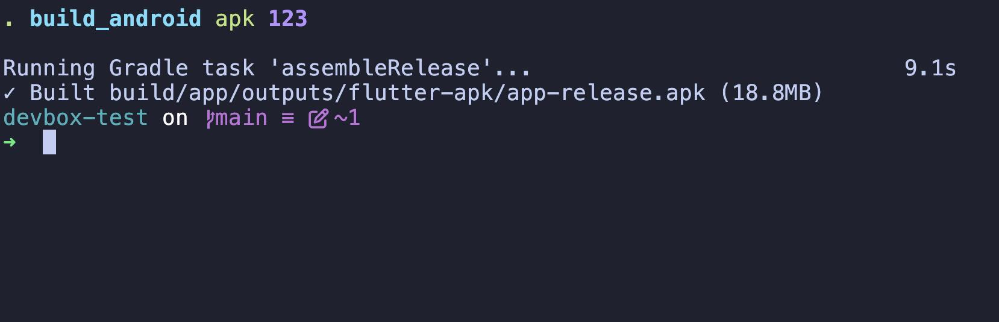
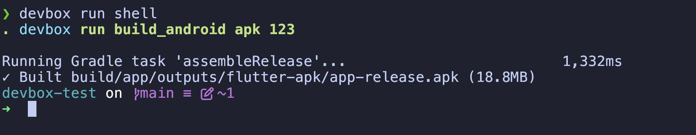

### Configure dev environment with devbox

1. [1-liner to install devbox](https://www.jetify.com/docs/devbox/installing_devbox/?install-method=macos)

2. `devbox run shell` to enter interactive shell environment. This can be configured in `shell.nu` [read more](https://www.nushell.sh/).

3. devbox "scripts", just like npm scripts: use `devbox run <name>` to run any of scripts defined in `devbox.json` 

4. If you use VS Code you can install [devbox by Jetify](https://marketplace.visualstudio.com/items?itemName=jetpack-io.devbox) extension.
